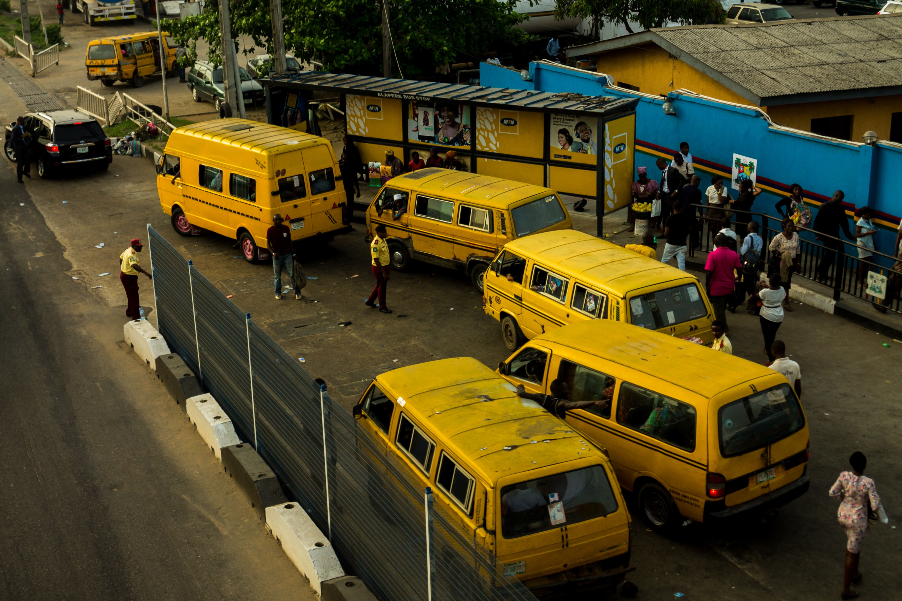
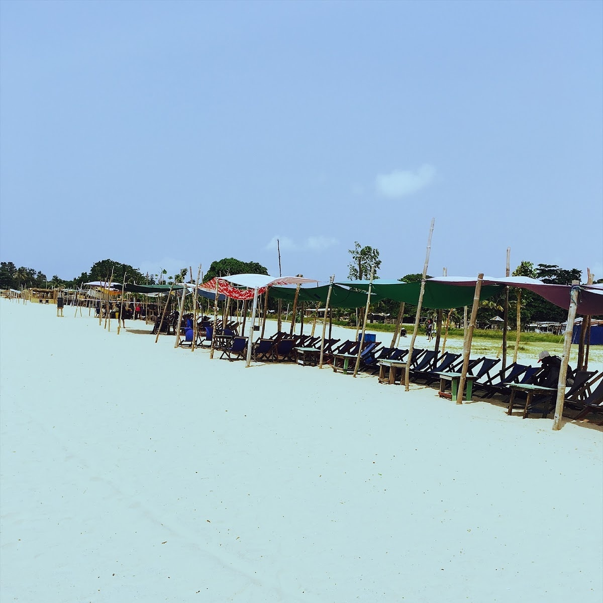
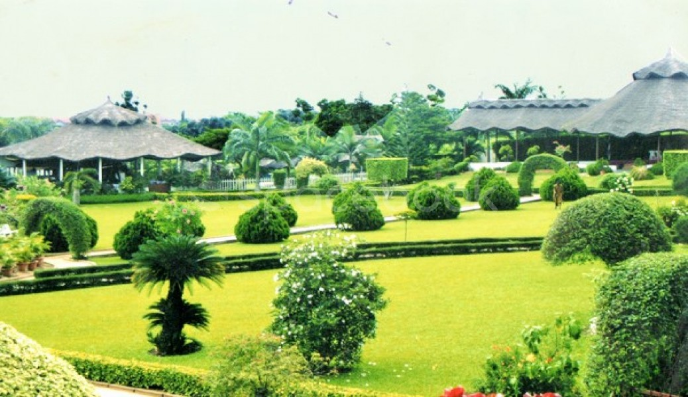

# Lagos
Lagos, Nigeria’s largest city, sprawls inland from the Gulf of Guinea across Lagos Lagoon. Victoria Island, the financial center of the metropolis, is known for its beach resorts, boutiques and nightlife. To the north, Lagos Island is home to the National Museum Lagos, displaying cultural artifacts and craftworks. Nearby is Freedom Park, once a colonial-era prison and now a major venue for concerts and public events.

Beaches line the Lekki Peninsula running east from the city, while inland, the Lekki Conservation Centre offers wildlife and trails. The National Gallery of Modern Art shares a building with the National Arts Theatre, and showcases works by Nigerian artists. Local arts and crafts can be found at colorful Lekki Market, and at private galleries across the city. North of the center, the life of Lagos musician Fela Kuti is celebrated at the Kalakuta Museum. To the west, the town of Badagry contains sites and museums documenting the town's history as a slave port, including the Badagry Heritage Museum. 
## Things to do

### Tarkwa Bay Beach

Tarkwa Bay is an artificial sheltered beach located near the Lagos harbour in Nigeria. Due to its island status, it is only accessible by boat or water taxis. The beach, popular with swimmers and water-sports enthusiasts, also has a welcoming resident community.

### Jhalobia Recreation Park and Gardens

Jhalobia Recreation Park and Garden is one of the premier recreation parks and gardens in Nigeria. It is located on Murtala Muhammed Airport Road, Lagos. It is marked by a stylish use of tropical plants and architecture.

  <a href="https://www.google.com/destination?q=lagos+nigeria&rlz=1C1CHBF_enNG818NG818&output=search&dest_mid=/m/0lnfy&sa=X&ved=2ahUKEwjru6-HsNrkAhUE2-AKHXJuCgEQ6tEBKAQwC3oECBMQBw#dest_mid=/m/0lnfy&tcfs=EisKCC9tLzBsbmZ5EgVMYWdvcxoYCgoyMDE5LTEwLTA0EgoyMDE5LTEwLTA4">source</a>

